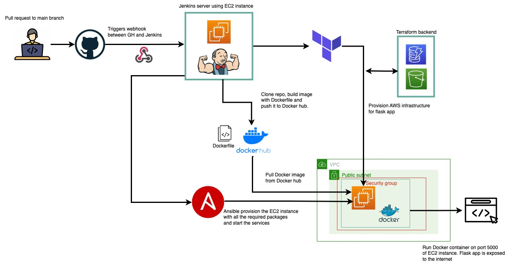

# My Simple WebApp - Project Workflow

This project automates the deployment of a Flask web application using DevOps tools like Docker, Terraform, AWS, Ansible, and Jenkins.

## 📌 Workflow Overview

1. **Code Commit & CI/CD Trigger**  
   - A commit or pull request to the **main** branch triggers the Jenkins pipeline.

2. **Build & Push Docker Image**  
   - Jenkins builds a Docker image of the Flask app and pushes it to Docker Hub.

3. **Provision AWS Infrastructure (Terraform)**  
   - Terraform creates an **EC2 instance**, **security group**, and necessary networking.

4. **Server Configuration (Ansible)**  
   - Ansible installs dependencies and deploys the Flask application on the EC2 instance.

5. **Run the Web Application**  
   - The Flask app runs inside a Docker container on **port 5000**.

6. **Automated Deployment**  
   - The entire process ensures smooth and repeatable deployments on every code update.

---
✅ This setup provides an automated, scalable, and efficient deployment workflow. 🚀  
